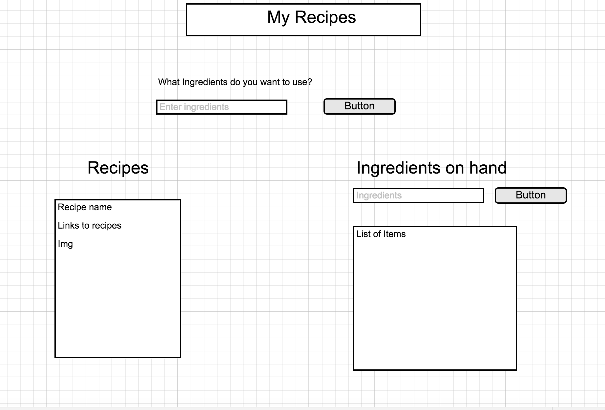

# Intro

What's for dinner tonight? What do you have in your fridge? MyRecipe app will allow the user to search for recipes based on their ingredients.

# User Stories
* Guests
 * Guest can search recipes based on ingredients
 * Guest can view all the recipes 
 * Guest can search for recipes 
 
# Technologies Used
* Ruby
* Httparty

# API Used
* [Recipe Puppy] (http://www.recipepuppy.com/api/)

# Wireframes

# Help Docs
*Arlen helping with the form and api
*http://guides.rubyonrails.org/form_helpers.html
